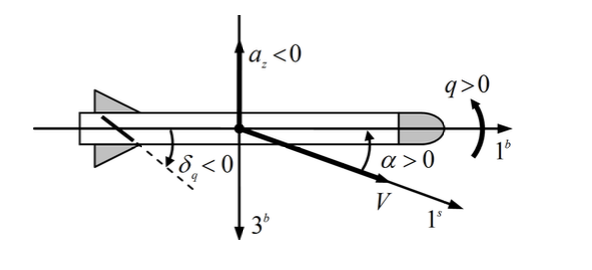

# Robust Flight Control Project

## Introduction

The goal of this project is to understand and apply the basic principles of robust control design using MATLAB/Simulink and relevant toolboxes. The system considered is a linearized model of a highly agile air-to-air missile for a given flight condition. This type of model is common in aerospace applications and approximates the pitch axis, short period flight dynamics of the missile for a fixed operating point. This project involves various stages of controller design and tuning, aiming to enhance model performance while respecting robustness constraints.

## Objectives

1. **System Modeling**: Develop a linearized model of the missile and its actuator.
2. **Loop Shaping**: Shape the open-loop transfer function to meet performance and robustness criteria.
3. **Mixed Sensitivity Design**: Design a robust controller using the H-infinity (H∞) method.
4. **Weighting Filters**: Define appropriate weighting filters to balance performance and robustness.
5. **Reference Model**: Establish a reference model to guide the controller design.
6. **Feedback Controller Design**: Implement feedback controllers using hinfsyn and hinfstruct methods.
7. **Feedforward Controller Design**: Design a feedforward controller to improve tracking performance.
8. **Controller Redesign**: Redesign the controller using the systune function to optimize performance without a feedforward controller.

## Deliverables

1. **Written Report**: A detailed report in PDF format, including:
   - Analytical descriptions and plots/figures for each question in the assignment.
   - Commentary on the design procedures and results.

2. **MATLAB/Simulink Files**: A zipped file containing:
   - `Main.m`: A standalone MATLAB script implementing the project in separate cells.
   - Seven Simulink models used throughout the assignment:
     - `Airframe.slx`
     - `ClosedLoop_Cq.slx`
     - `ClosedLoop_CqCsc.slx`
     - `ClosedLoop_CqCscCi.slx`
     - `Design.slx`
     - `OpenLoop_Test.slx`
     - `ClosedLoop_Test.slx`

## Prerequisites

- Basic understanding of MATLAB/Simulink.
- Familiarity with control system design principles and robust control techniques.
- Review of course slides and relevant literature to fully grasp the material required for the assignment.

## Project Structure

### Part 1: System Modeling (20%)

- Develop a linearized model of the missile and its actuator dynamics.
- Include uncertainty levels and model the control-fin actuator.

### Part 2: Loop Shaping (20%)

- Shape the open-loop transfer function to achieve desired performance and robustness.
- Use Bode plots and gain/phase margins to guide the design.

### Part 3: Mixed Sensitivity Design (60%)

- **Weighting Filters (5%)**: Define and tune weighting filters.
- **Reference Model (5%)**: Establish a reference model for desired performance.
- **Feedback Controller Design (hinfsyn) (20%)**: Design a robust H∞ feedback controller.
- **Feedback Controller Design (hinfstruct) (15%)**: Design a structured H∞ feedback controller.
- **Feedforward Controller Design (15%)**: Design a feedforward controller to enhance tracking.

### Part 4: Feedback Controller Redesign (Optional, 20%)

- **Tuning Interface (10%)**: Use the Control System Tuner app to set up the tuning interface.
- **Feedback Controller Redesign (systune) (10%)**: Redesign the controller using systune for improved performance without a feedforward controller.

## Expected Outcomes

- A robust control system capable of maintaining performance despite model uncertainties.
- Improved understanding of advanced control design techniques using MATLAB/Simulink.
- Demonstration of practical skills applicable to aerospace control systems.

## Contact

For any questions or further information, please contact [randolfnkimo@gmail.com].
